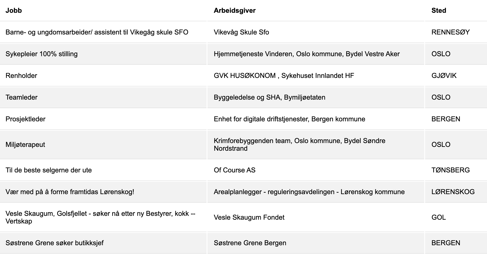

# RSS 2.0 feed from NAV job ads public API

A google cloud function to convert NAVs API to RSS 2.0 (https://github.com/navikt/pam-public-feed)

Intended to be suitable for tools like Feedly, IFTTT, Flow.


## Link to the feed 

https://tovare.com/jobb/rss

(Example live feed)

## Supported filters

(see original API for docs)

* size
* municipal
* county

https://tovare.com/jobb/rss?size=100&municipal=BERGEN

## Configure and deploy

See the quickstart documentation https://cloud.google.com/functions/

### With development token:
gcloud functions deploy RSSFeed --memory=128 --runtime go113 --trigger-http

### With production token from NAV:
gcloud functions deploy RSSFeed --memory=128 --runtime go113 --trigger-http --env-vars-file .env.yaml

Create a filee for enviromeent configuration .env.yaml contains:
```
ARBEIDAPI: "<insert key>"
```

# Harvesting to firebase

harvestproc.go contains a pub/sub functions which stores into firebase.
The model defined in feed.go is mapped to both firebase and json results.

gcloud functions deploy UpdateAndStore --memory=128 --runtime go113 --trigger-topic oppdater

# Webcomponent stillinger.js for arbeidsplassen

Demo [https://tovare.com/jobb/](https://tovare.com/jobb/)

This 30 Kb web component fetches directly from arbeidsplassen.nav.no 

Example:
    <script src="stillinger.js" async></script>
    <stilling municipal="Viken" size="10"> </stilling>

Supported parameter:
  *  size
  *  municipal
  *  county
  *  size

All component-properties are reactive.

   // Get the element by the id you set.
   var s = document.getElementById("#mystillinger");
   // Change the property directly (not via setProperty)
   // this will cause the component to fetch updated data.
   s.municipal = "Oslo"


# Webcomponent tovare.com

Demo [https://tovare.com/jobb/](https://tovare.com/jobb/)

    <script src="sisteStillinger.js" async></script>

    <siste-stillinger></siste-stillinger>
****
    <!-- vis 10 stillinger -->
    <siste-stillinger antall="10"></siste-stillinger>



